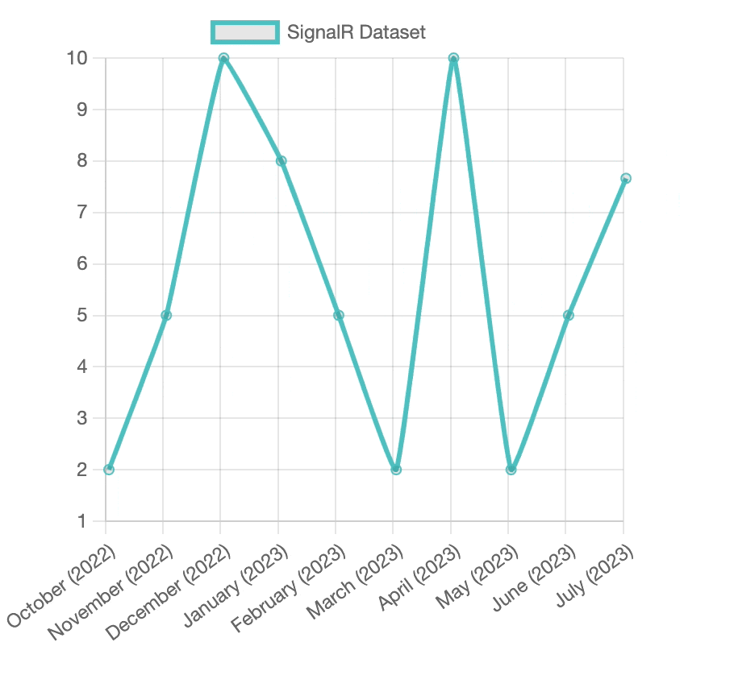

## Real-time Charts with ASP.NET Core, SignalR, and Chart.js



This project shows how to update a real-time chart in your web browser
using technologies like ASP.NET Core, SignalR, and Chart.js.

> **Note**
> The backend is contrived using a `Buffer` type that is **not thread-safe**. Substitute your own implementation where data is derived from a database, web service, etc.

## Getting Started

- The latest .NET SDK (6+) (https://dot.net)
- A .NET IDE like [JetBrains Rider](https://jetbrains.com/rider)

After installing the dotnet sdk, you can run the project.

```bash
dotnet run --project Charts -lp http
```

Then navigate to [`http://localhost:5296`](http://localhost:5296) if the browser did not open.

## Thoughts

### SignalR Setup

- Setting up SignalR was relatively painless, but required some reading about what a `Hub` is and what a `IHubContext<THub>` is.
- Using LibMan to manage JavaScript dependencies is nice. Check out `libman.json` in web project. There are several **SignalR** packages, so finding the right one was annoying.

## Background Service

- A background service is a nice approach to having a recurring event happen.

## ASP.NET Core Razor Pages

- I was able to do everything in Razor, but could have easily moved things to the `IndexModel`. By everything I mean injecting dependencies and generating the starting JSON for our Chart.JS element.
- I ❤️ Razor Pages

## Chart.Js

- Relatively straightforward to set up and very responsive. The use of Canvas also allows for some interesting scenarios that I could explore later.
- Getting data from the Razor Page/ASP.NET Core to ChartJs is an interesting challenge. I ended up using a `script` element with a type of `application/json`. Seems reasonable to me. The other choice was a global value on the `window` element.
